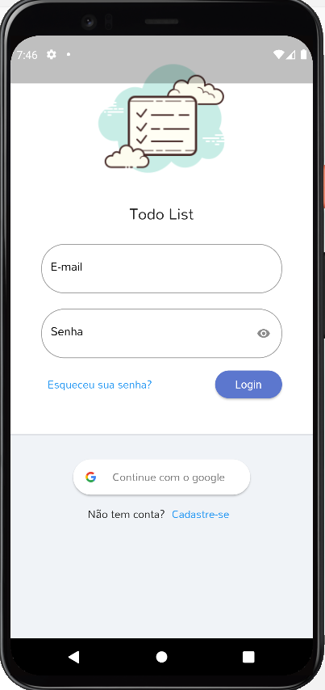
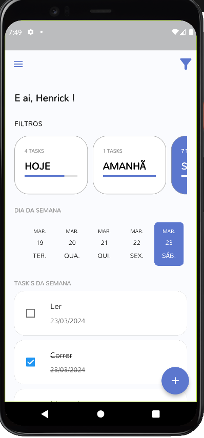
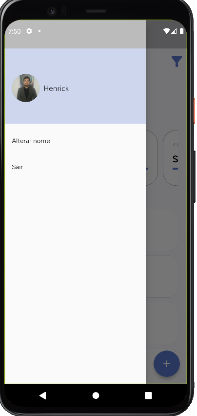
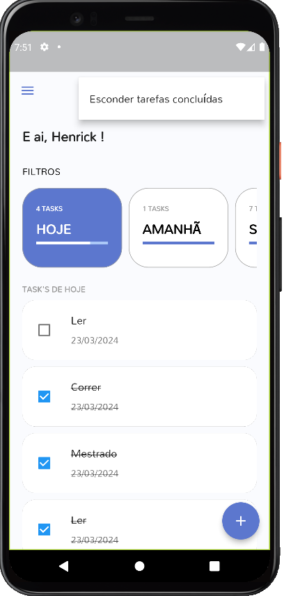
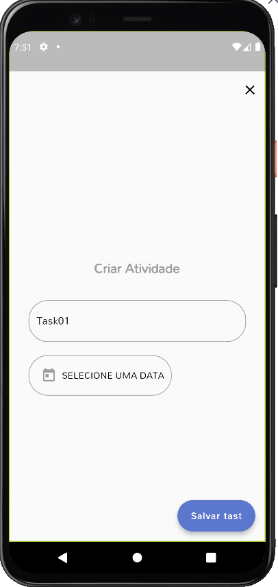
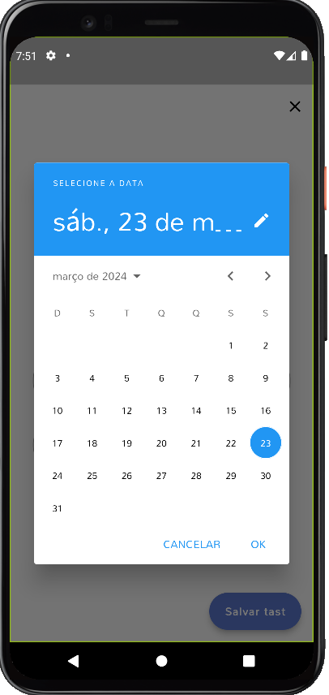

<h1 align="center">
   
</h1>

<h4 align="center"> 
	🚧 TODO Task 🚀 Concluido...  🚧
</h4>

## ✅ Funções

- <h3>Gerenciamento de Usuários:</h3>

  - [x] Login
  - [x] Cadastro
  - [x] Logar com Google

- <h3>Home</h3>

  - [x] Visualizar Tasks
  - [x] Filtrar Tasks
  - [x] Cadastrar Task
  - [x] Finalizar Task

- <h3>Perfil</h3>

  - [x] Editar Perfil

## 📚 Descrição

- Desenvolvi um aplicativo em Flutter que auxilia como você gerencia suas tarefas semanais. Com a capacidade de filtrar tarefas por dia e semana, você pode planejar e ajustar sua agenda com facilidade. O aplicativo permite não apenas cadastrar novas tarefas, mas também finalizá-las com um simples toque, garantindo que você mantenha o foco e a produtividade.

- 💡💻 Feito com o poder do PROVIDER e Firebase, este aplicativo oferece uma experiência de usuário suave e um armazenamento de dados confiável. Se você está procurando uma solução inteligente para o gerenciamento de tarefas, este app é a escolha certa!

## 🛠 Tecnologias

As seguintes ferramentas foram usadas na construção do projeto:

-  [Flutter](https://flutter.dev/?gclid=Cj0KCQjwkbuKBhDRARIsAALysV4sMSKWcOxrlBmdtlCcf3MAfNdH1ehbbWi6ZjjjdypPLsSvdTFiqOYaAon3EALw_wcB&gclsrc=aw.ds)
-  [Dart](https://dart.dev/)

## 📱 Plataforma adotada

- Android;
- iOS;

## 📸 Screenshot

	
	
	

	
	
	

